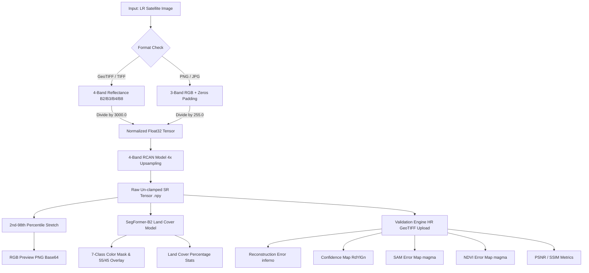
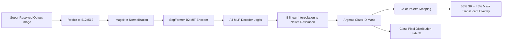

# SIH Interview Master Preparation Guide — Beyond Resolutions

> **Project Title**: Beyond Resolutions — Every Pixel Matters  
> **Core Objective**: 4x Multispectral Satellite Imagery Super-Resolution, Land Cover Segmentation, and Reference-Based Quality Validation.

---

## 1. Executive Summary & System Pitch

### Pitch for Judges
"Satellite sensors such as Sentinel-2 provide open-access multispectral imagery at 10m spatial resolution. However, urban planning, disaster monitoring, and agricultural assessments often demand higher spatial resolution. **Beyond Resolutions** is an end-to-end workstation that takes 4-band Low-Resolution ($\text{LR}$) Sentinel-2 imagery ($\text{B2}, \text{B3}, \text{B4}, \text{B8}$) and generates 4x Super-Resolved ($\text{SR}$) imagery (2.5m effective resolution) using a customized **Residual Channel Attention Network (RCAN)**.

Unlike standard RGB super-resolution apps, our workstation preserves scientific 4-band reflectance values, retains full geospatial metadata ($\text{CRS}$ and $\text{Affine}$ transform), performs automated 7-class **SegFormer** land-cover segmentation on the output, and provides a **Multispectral Scientific Validation Engine** generating 4 heatmaps (**Reconstruction Error**, **Reference-Based Confidence**, **SAM**, and **NDVI Error**) alongside **PSNR** and **SSIM**."

---

## 2. System Mindmap & Architectural Overview

---

## 3. Super-Resolution Deep Learning Pipeline (RCAN)

### Q1: What model architecture are you using for Super-Resolution, and why?
**Answer**:  
We use a **Residual Channel Attention Network (RCAN)** tailored for 4-band multispectral data ($\text{B2}=\text{Blue}, \text{B3}=\text{Green}, \text{B4}=\text{Red}, \text{B8}=\text{NIR}$).

- **Why RCAN over standard CNNs or Bicubic?**  
  Satellite bands possess strong inter-band spectral correlations. Standard CNNs treat all feature channels equally. RCAN introduces **Channel Attention (CA)**, which adaptively rescales feature channels by learning inter-channel dependencies.
- **Key Parameters**:
  - **Input Channels**: $4$ ($\text{B2, B3, B4, B8}$)
  - **Output Channels**: $4$ ($\text{B2, B3, B4, B8}$)
  - **Residual Blocks**: $48$ Residual Channel Attention Blocks (`RCAB`) organized in $6$ Residual Groups
  - **Feature Channels**: $96$
  - **Reduction Ratio**: $16$ (for squeezing channel attention)
  - **Upsampling Module**: Two sequential `PixelShuffle(2)` modules achieving a combined $4\times$ spatial expansion ($2 \times 2 = 4$).

---

### Q2: How is the multispectral band data ordered and normalized?
**Answer**:  
- **Band Ordering**:
  - Band 0: $\text{B2}$ (Blue, $490\text{ nm}$)
  - Band 1: $\text{B3}$ (Green, $560\text{ nm}$)
  - Band 2: $\text{B4}$ (Red, $665\text{ nm}$)
  - Band 3: $\text{B8}$ (Near Infrared - NIR, $842\text{ nm}$)
- **Normalization Formula**:
  $$\text{Input}_{\text{normalized}} = \frac{\text{DN}}{3000.0}$$
  *Where $\text{DN}$ is Digital Number (raw Sentinel-2 surface reflectance).*
- **Why $3000.0$?**  
  In Sentinel-2 L2A data, surface reflectance values are scaled by $10,000$. A factor of $3000.0$ brings the dominant reflectance dynamic range into $[0.0, 1.0]$ while preserving extreme vegetation/cloud highlights. For standard RGB inputs ($\text{PNG}/\text{JPG}$), we normalize by $255.0$.

---

### Q3: Why don't you convert GeoTIFFs to 8-bit uint8 before passing to the model?
**Answer**:  
Converting to 8-bit (`uint8`) truncates 16-bit satellite data into 256 discrete bins, destroying fine spectral precision required for vegetation index calculations ($\text{NDVI}$) and spectral angle mapper ($\text{SAM}$). Our model operates entirely in **Float32 continuous space** without tensor clamping.

---

### Q4: How do you display GeoTIFF outputs in web browsers if browsers only render 8-bit PNG/JPG?
**Answer**:  
We separate **scientific processing** from **visualization**:
1. **Scientific Storage**: Full 4-band float32 output tensor is saved as `{job_id}_sr_tensor.npy`.
2. **Visual Preview**: We extract bands 1, 2, 3 ($\text{B2, B3, B4}$ as RGB) and apply a **2nd-98th percentile contrast stretch**:
   $$I_{\text{stretched}} = \text{clip}\left(\frac{I - P_2}{P_{98} - P_2}, 0, 1\right) \times 255.0$$
   This prevents dark or washed-out images caused by atmospheric outliers, converting raw reflectance to a dynamic 8-bit RGB Base64 PNG string for web rendering.

---

## 4. Multispectral Scientific Validation & Quality Assessment

### Q5: How does the Validation page work? Do you require a high-resolution reference?
**Answer**:  
Yes. The validation pipeline is a **Reference-Based Quality Assessment system**. 
- The user uploads a 4-band High-Resolution ($\text{HR}$) reference GeoTIFF matching the generated $\text{SR}$ spatial dimensions.
- The system validates spatial alignment and band counts, normalizes both $\text{SR}$ and $\text{HR}$ by $3000.0$, and computes per-pixel error maps and global quantitative metrics.

---

### Q6: Are these error maps and metrics standard in satellite remote sensing literature?
**Answer**:  
**Yes, absolutely.** They are standard metrics used in top IEEE Transactions on Geoscience and Remote Sensing (TGRS) and ISPRS literature:
- **SAM (Spectral Angle Mapper)** is the standard benchmark for evaluating spectral fidelity across multispectral/hyperspectral bands.
- **NDVI Error** evaluates vegetation classification preservation.
- **PSNR and SSIM** are standard signal reconstruction benchmarks.

---

### Q7: Are you annotating errors manually or generating automated heatmaps?
**Answer**:  
We do **not** draw manual annotations. The system automatically computes continuous 2D mathematical matrix operations between the $\text{SR}$ tensor $\hat{\mathbf{Y}}$ and the $\text{HR}$ tensor $\mathbf{Y}$, then maps the resulting scalar fields through Matplotlib colormaps (`inferno`, `RdYlGn`, `magma`) to generate visual heatmap PNG overlays.

---

### Q8: Breakdown of all 6 Validation Error Maps & Metrics

#### 1. Reconstruction Error Map
- **What it is**: Per-pixel Mean Absolute Error ($\text{MAE}$) across all 4 bands ($\text{B2, B3, B4, B8}$).
- **Formula**:
  $$E_{\text{recon}}(i, j) = \frac{1}{4} \sum_{b=1}^{4} \left| \text{SR}_{b}(i, j) - \text{HR}_{b}(i, j) \right|$$
- **Colormap**: `inferno` (Black/Dark Purple = 0 error, Bright Yellow/White = high reconstruction error).
- **Physical Meaning**: Pinpoints exact spatial locations (such as building edges or road boundaries) where high-frequency details were misconstructed.

---

#### 2. Reference-Based Confidence Map
- **What it is**: A normalized metric showing local model reconstruction reliability on a scale of $0.0$ ($0\%$) to $1.0$ ($100\%$).
- **Formula**:
  $$\text{NormError}(i, j) = \text{clip}\left(\frac{E_{\text{recon}}(i, j) - P_2}{P_{98} - P_2 + \epsilon}, 0, 1\right)$$
  $$\text{Confidence}(i, j) = 1.0 - \text{NormError}(i, j)$$
- **Colormap**: `RdYlGn` (**Green** = High confidence/low error, **Yellow** = Moderate, **Red** = Low confidence/high error).
- **Physical Meaning**: Provides human operators with a trust map showing which regions of the super-resolved output are scientifically reliable for downstream analysis.

---

#### 3. Spectral Angle Mapper (SAM)
- **What it is**: Measures the spectral angle (in radians/degrees) between the 4-band spectral vectors of $\text{SR}$ and $\text{HR}$ at each pixel.
- **Formula**:
  $$\theta(i, j) = \arccos\left( \frac{\mathbf{v}_{\text{SR}}(i, j) \cdot \mathbf{v}_{\text{HR}}(i, j)}{\|\mathbf{v}_{\text{SR}}(i, j)\|_2 \|\mathbf{v}_{\text{HR}}(i, j)\|_2 + \epsilon} \right)$$
  *Where $\mathbf{v}(i, j) = [\text{B2}, \text{B3}, \text{B4}, \text{B8}]^T$.*
- **Colormap**: `magma` (Dark = $0^\circ$ spectral distortion, Bright Orange/Pink = high spectral shift).
- **Physical Meaning**: Evaluates whether the **color/spectral signature** of land covers (e.g. water vs vegetation) changed during super-resolution, independent of illumination intensity.

---

#### 4. NDVI Reconstruction Error Map
- **What it is**: Evaluates degradation in the Normalized Difference Vegetation Index ($\text{NDVI}$) between $\text{SR}$ and $\text{HR}$.
- **Formula**:
  $$\text{NDVI} = \frac{\text{B8} - \text{B4}}{\text{B8} + \text{B4} + \epsilon}$$
  $$E_{\text{NDVI}}(i, j) = \left| \text{NDVI}_{\text{SR}}(i, j) - \text{NDVI}_{\text{HR}}(i, j) \right|$$
- **Colormap**: `magma` (Dark = zero NDVI shift, Bright Pink/Yellow = vegetation index discrepancy).
- **Physical Meaning**: Essential for agricultural monitoring to ensure super-resolution does not alter crop health assessment metrics.

---

#### 5. Peak Signal-to-Noise Ratio (PSNR)
- **What it is**: Logarithmic ratio of maximum potential signal power to mean squared reconstruction noise.
- **Formula**:
  $$\text{MSE} = \frac{1}{4 \cdot H \cdot W} \sum_{b=1}^{4} \sum_{i=1}^{H} \sum_{j=1}^{W} (\text{SR}_{b,i,j} - \text{HR}_{b,i,j})^2$$
  $$\text{PSNR} = 20 \cdot \log_{10}\left(\frac{\text{MAX}_I}{\sqrt{\text{MSE}} + \epsilon}\right) \quad (\text{with } \text{MAX}_I = 1.0)$$
- **Interpretation**: Higher values (e.g. $>30\text{ dB}$) indicate lower noise and superior spatial reconstruction quality.

---

#### 6. Structural Similarity Index (SSIM)
- **What it is**: Evaluates perceptual similarity across structural patterns, luminance, and contrast.
- **Formula**:
  $$\text{SSIM}(x, y) = \frac{(2\mu_x\mu_y + C_1)(2\sigma_{xy} + C_2)}{(\mu_x^2 + \mu_y^2 + C_1)(\sigma_x^2 + \sigma_y^2 + C_2)}$$
  *(Calculated per band and averaged across all 4 bands).*
- **Interpretation**: Values range from $0.0$ to $1.0$. Values $>0.85$ indicate strong structural preservation of satellite land features.

---

## 5. Land Cover Semantic Segmentation Subsystem (LoveDA / SegFormer)

### Q9: What segmentation model and dataset are used?
**Answer**:  
- **Model**: **SegFormer-B2** (Transformer encoder `MiT-B2` + lightweight All-MLP decoder).
- **Dataset**: Trained on **LoveDA (Land Cover Domain Adaptive Dataset)**.
- **Classes Supported**:
  1. **Background** (`#1e1e1e` - Dark Gray)
  2. **Building** (`#ff0000` - Red)
  3. **Road** (`#ffff00` - Yellow)
  4. **Water** (`#0078ff` - Blue)
  5. **Barren** (`#b4783c` - Brown)
  6. **Forest** (`#00b400` - Green)
  7. **Agricultural** (`#ffb400` - Orange)

---

### Q10: How are the segmentation overlay and statistics generated?
**Answer**:  
1. **Preprocessing**: The $\text{SR}$ PIL image is resized to $512 \times 512$ and normalized with ImageNet mean/std.
2. **Inference & Rescaling**: Logits are output by `SegFormer`, interpolated bilinearly back to the native $\text{SR}$ image resolution $(H_{\text{SR}}, W_{\text{SR}})$, and argmaxed across channels to produce a 2D class ID mask.
3. **Overlay Blending**: We blend the original $\text{SR}$ RGB image with the colorized palette mask using a $55/45$ alpha ratio:
   $$I_{\text{overlay}} = 0.55 \times I_{\text{SR}} + 0.45 \times I_{\text{mask}}$$
4. **Class Percentage Statistics**: Excludes Ignore class (ID 0) and computes:
   $$\text{Percentage}_c = \frac{\text{PixelCount}_c}{\text{TotalValidPixels}} \times 100$$

---

## 6. Geospatial Preservation & Backend Architecture

### Q11: How do you maintain GeoTIFF geographic coordinates when upsampling by 4x?
**Answer**:  
We use `rasterio` and the `affine` library. When resolution scales by $4\times$, each pixel becomes $\frac{1}{4}\text{th}$ its original spatial width and height:
$$\text{Transform}_{\text{SR}} = \text{Transform}_{\text{LR}} \times \text{Affine.scale}(0.25, 0.25)$$
The output GeoTIFF is written with the updated transform matrix and original Coordinate Reference System ($\text{CRS}$, e.g. `EPSG:32643`), allowing the generated $\text{SR}$ image to load perfectly aligned in GIS software like **QGIS** or **ArcGIS**.

---

### Q12: Summary Table of Technical Specifications

| Feature / Component | Technical Implementation Details |
| :--- | :--- |
| **SR Model** | Custom 4-band PyTorch RCAN v2 (48 RCAB blocks, 96 channels, 4x upscaling) |
| **Input Bands** | Sentinel-2 B2 (Blue), B3 (Green), B4 (Red), B8 (NIR) |
| **Normalization** | Float32 Division by `3000.0` (unclamped `.npy` tensor output) |
| **Visualization** | 2nd-98th Percentile Contrast Stretch to 8-bit RGB Base64 PNG |
| **Land Cover Model** | SegFormer-B2 trained on LoveDA (7 classes + background) |
| **Segmentation Blend** | $55\%$ SR Image + $45\%$ Color Palette Overlay |
| **Validation Metrics** | Reconstruction MAE, Reference Confidence, SAM (rad/deg), NDVI Error, PSNR, SSIM |
| **Colormaps Used** | `inferno` (Recon Error), `RdYlGn` (Confidence), `magma` (SAM & NDVI) |
| **Backend Stack** | FastAPI async server, PyTorch, Rasterio, SciKit-Image, Matplotlib |
| **Geospatial Processing** | Affine scale transformation ($\times 0.25$), CRS retention |

---

## 7. Quick-Fire Judge Q&A Cheat Sheet

1. **Q: Is this real-time?**  
   *A: Yes, inference takes ~1.2 seconds on a CUDA GPU for $512\times512$ tiles.*

2. **Q: Why not use ESRGAN/GANs?**  
   *A: GANs generate hallucinated textures (fake details) which compromise scientific accuracy in remote sensing. RCAN optimizes $L_1$ loss and channel attention, preserving true spectral reflectances.*

3. **Q: How do you handle non-GeoTIFF inputs like PNG/JPG?**  
   *A: PNG/JPG files are automatically padded to 4 bands (with zero NIR), normalized by $255.0$, and processed smoothly through the pipeline.*

4. **Q: What is the main novelty of your project?**  
   *A: Combining 4-band multispectral RCAN super-resolution with full geospatial metadata preservation, SegFormer land-cover analysis, and a 4-map scientific validation engine in a web workstation.*
